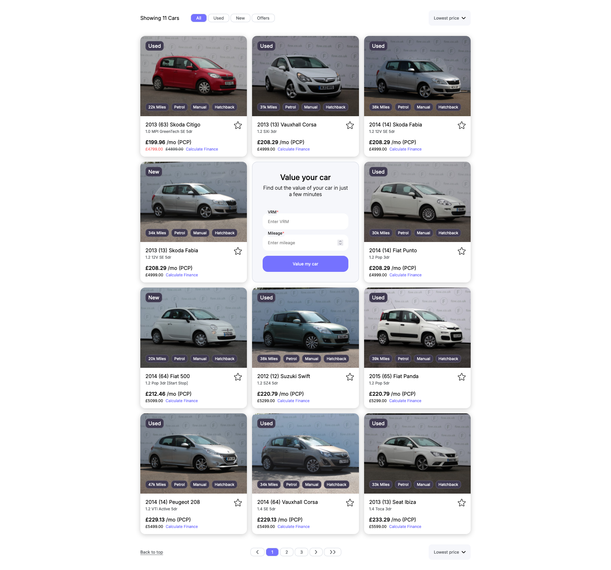

# Car Filter App

## Table of contents

- [Overview](#overview)
  - [The challenge](#the-challenge)
  - [Screenshot](#screenshot)
  - [Links](#links)
- [My process](#my-process)
  - [Built with](#built-with)
- [Author](#author)

## Overview

### The challenge

Users should be able to:

- Browse and filter a list of cars based on classification (All, Used, New, Offers)
- Sort the cars by price (Lowest price, Highest price)
- Navigate through pages to view more cars
- Toggle favorite status on cars
- View car details including pricing, key features, and images
- Access a form to value their own car

### Screenshot

### Links

- Solution URL: [https://github.com/RyanNolan1/car-filter](https://github.com/RyanNolan1/car-filter)
- Live Site URL: [https://carfilter.netlify.app/](https://carfilter.netlify.app/)

## My process

### Built with

- Semantic HTML5 markup
- CSS custom properties
- Flexbox
- React

## Author

- Website - [http://ryannolan.uk/](http://ryannolan.uk/)
- LinkedIn - [ryan-nolan1](https://www.linkedin.com/in/ryan-nolan1/)
